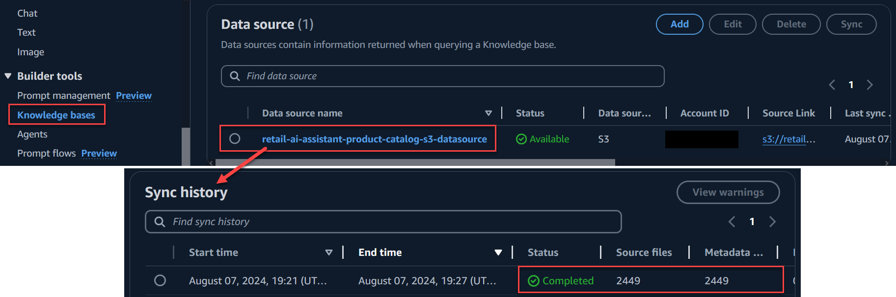
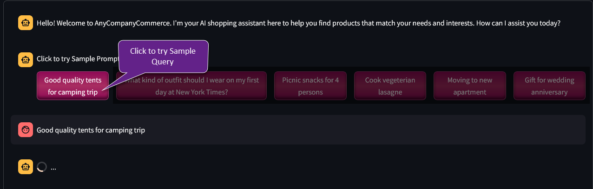
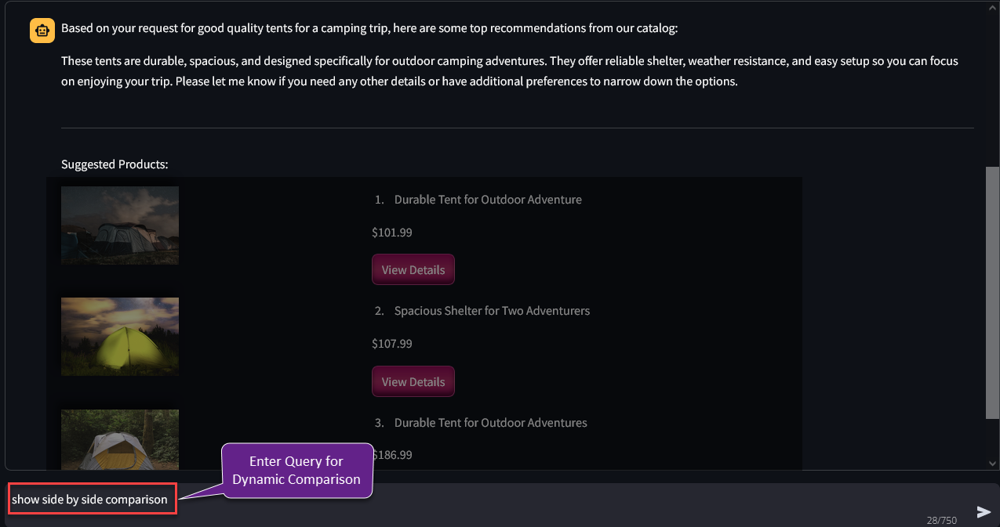
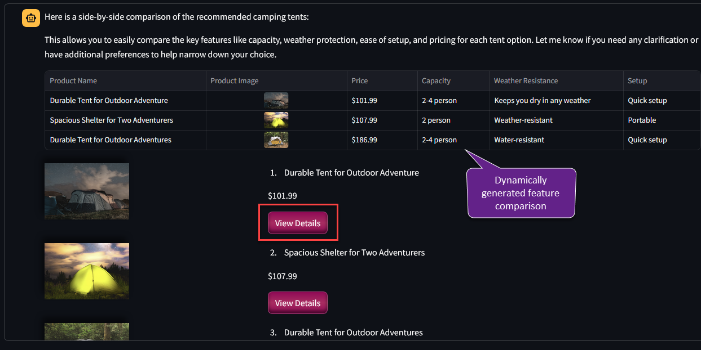
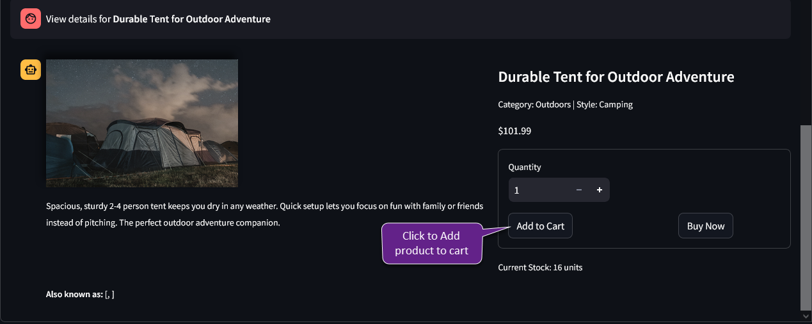
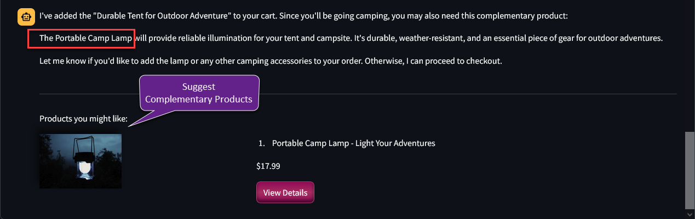
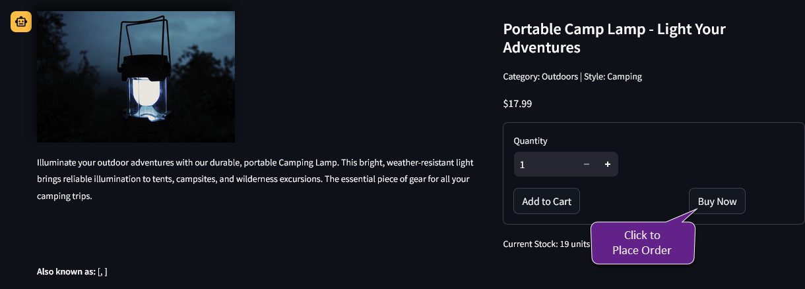
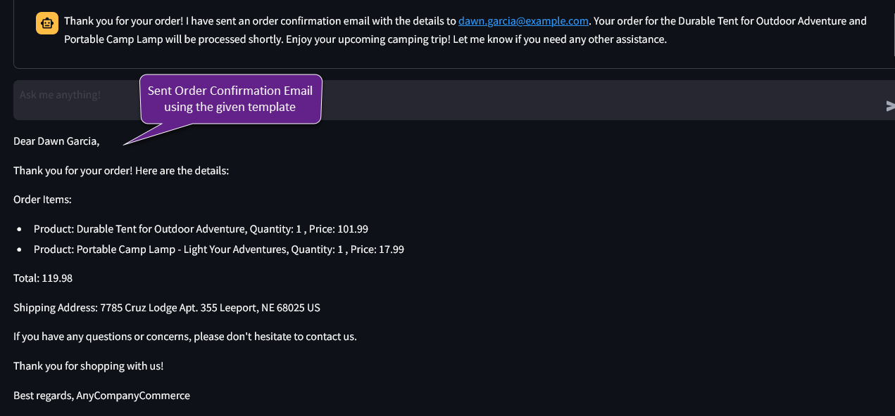
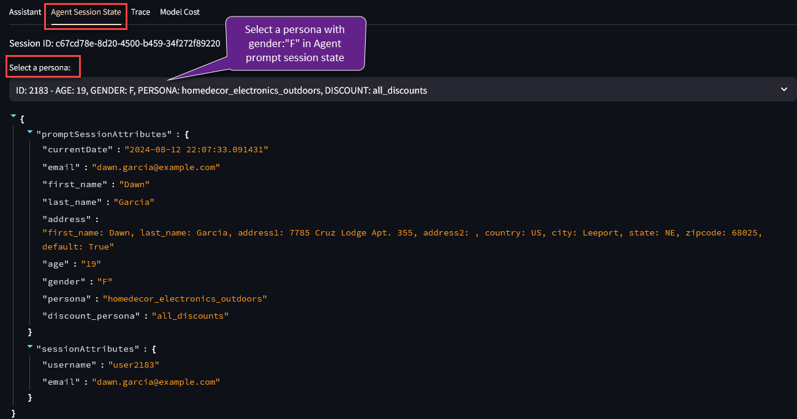
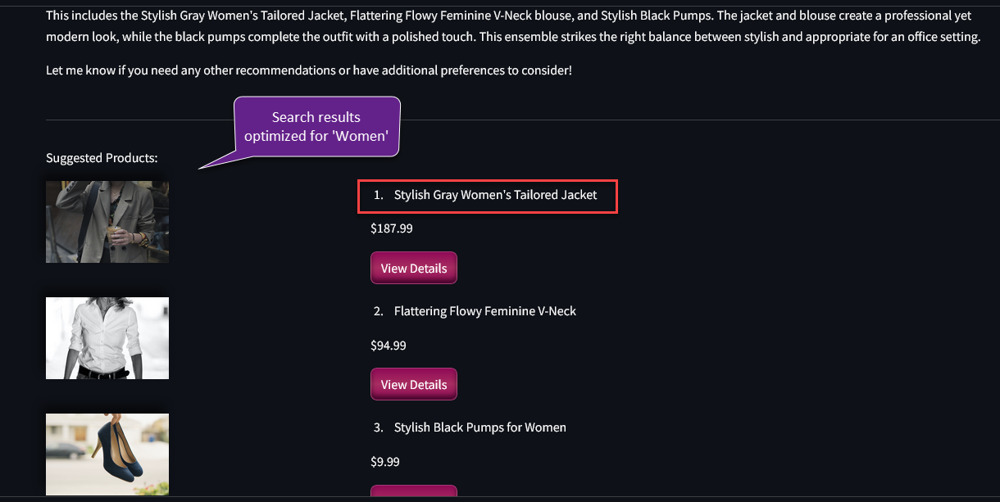

# Guidance for Generative AI Shopping Assistant using Agents for Amazon Bedrock

## Table of Contents
1. [Overview](#overview)
    - [Solution Overview](#solution-overview)
    - [Architecture](#architecture)
    - [Cost](#cost)
2. [Prerequisites](#prerequisites)
    - [Operating System](#operating-system)
    - [Amazon Bedrock Model Access](#amazon-bedrock-model-access)
3. [Deployment Steps](#deployment-steps)
4. [Deployment Validation](#deployment-validation)
5. [Running the Guidance](#running-the-guidance)
6. [Next Steps](#next-steps)
7. [Cleanup](#cleanup)
8. [FAQ, known issues, additional considerations, and limitations](#faq-known-issues-additional-considerations-and-limitations)
9. [Testing app locally on your machine](#testing-app-locally-on-your-machine)
10. [Notices](#notices)
11. [Authors](#authors)


## Overview
This Guidance demonstrates how to create powerful, generative AI-driven shopping assistant that enhances customer experience and drives sales through context-aware, AI-powered interactions. The solution utilizes [Agents for Amazon Bedrock](https://docs.aws.amazon.com/bedrock/latest/userguide/agents.html) to orchestrate various functions like personalized and related product recommendations, dynamic contextual product comparisons, cart management, and automated order & email confirmation. The agent seamlessly integrates with existing company systems and data securely and minimizes the time and complexity needed for building sophisticated LLM (Large Language Model) Agents. 

### Solution Overview
This Guidance deploys a Streamlit-based Python web application on Amazon ECS Fargate, which calls the [Amazon Bedrock API](https://docs.aws.amazon.com/bedrock/latest/userguide/what-is-bedrock.html) for natural language conversations. The Shopping Agent is built using Agents for Amazon Bedrock which utilizes Anthropic's Claude 3 Sonnet model to interpret user queries and orchestrate multi-step tasks for efficient shopping experience. 

To assist customers in finding relevant products, the Shopping Agent is integrated with a [Knowledges Bases for Amazon Bedrock](https://docs.aws.amazon.com/bedrock/latest/userguide/knowledge-bases.html), which embeds product catalog details from Amazon S3 and stores them in [Amazon OpenSearch Serverless](https://docs.aws.amazon.com/opensearch-service/latest/developerguide/serverless.html) for vector search. Additionally, the Shopping Agent includes an Action Group that utilizes AWS Lambda function with OpenAPI Schema to manage API operations such as order creation, inventory checks, and sending email confirmations. 

The Solution also implements various techniques for minimizing LLM Hallucinations:
- Clear & structured step-by-step instructions to LLM for performing specific tasks
- Instructions to avoid suggesting alternate brand names or products not found in catalog
- Asking LLM to self-validate the API inputs & JSON structure using a technique called self-consistency prompt
- Provide templates for formatting the product list in LLM response and email structure using agent's Orchestration prompt template
- Guided UI interactions through forms and buttons to avoid free-form user input mistakes

### Architecture

This section will have architecture diagram and steps from Solution Guidance.

### Cost

You are responsible for the cost of the AWS services used while running this Guidance. As of August 2024, the estimated cost for running this Guidance with the default settings in the US East (N. Virginia) Region is approximately $2,777.76 per month for processing 100,000 generative-AI powered user requests.

We recommend creating a [Budget](https://docs.aws.amazon.com/cost-management/latest/userguide/budgets-managing-costs.html) through [AWS Cost Explorer](https://aws.amazon.com/aws-cost-management/aws-cost-explorer/) to help manage costs. Prices are subject to change. For full details, refer to the pricing webpage for each AWS service used in this Guidance.

### Sample Cost Table

The following table provides a sample cost breakdown for deploying this Guidance with the default parameters in the US East (N. Virginia) Region for one month.

| AWS Service                  | Dimensions                                                                 | Monthly Cost [USD] |
|------------------------------|----------------------------------------------------------------------------|------------|
| Amazon API Gateway           | 1,00,0000 REST API calls per month                                           | $3.50      |
| Amazon Cognito               | 1,000 active users per month without advanced security feature             | $0.00      |
| Amazon ECS Fargate           | 1 task running 24/7, 0.5 vCPU, 1 GiB memory                                | $18.03     |
| Application Load Balancer    | 1 ALB with HTTPS listener, 10 new connections/sec, 10 average number of requests/sec with free rule evaluations quota                         | $18.77     |
| Amazon CloudFront            | 500 MB images served, 10,000 requests                                      | $0.00      |
| Amazon S3                    | 100 GB S3 Standard storag, 10,000 PUT requests, 300,000 GET requests         | $2.47      |
| AWS Lambda                   | 500,000 requests, 60 ms/request, 1024 MB Memory                                        | $0.00      |
| Amazon OpenSearch Serverless | 1 GB index data, minimum non-HA usage cost, 0.5 OCU for Indexing, 0.5 OCU for Search and Query      | $175.22     |
| Amazon CloudWatch Logs       | 10 GB Standard Logs & 5 GB VPC Logs                                                        | $7.57      |
| Amazon Titan Text Embeddings v1       | On-Demand, for embedding 2,20,00,000 input tokens                                                | $2.20      |
| Amazon Bedrock Agent - Anthropic Claude 3 Sonnet       | On-Demand, Average 6000 input tokens & 500 output tokens for 100,000 product search queries                                                  | $2550.00      |
| **Total**                    |                                                                            | **$2,777.76** |

**Cost Considerations:**

- **OpenSearch Serverless**: This service incurs minimum cost of 1 OCU even when not in use. Check [Amazon OpenSearch Serverless updated pricing](https://aws.amazon.com/about-aws/whats-new/2024/06/amazon-opensearch-serverless-entry-cost-half-collection-types/) as of June 2024.

- **Anthropic Claude 3 Sonnet Model**: Costs are determined by the number of tokens processed during agent conversation. This model is large and optimized for complex tasks, which may result in higher costs for extensive usage. See [considerations](#faq-known-issues-additional-considerations-and-limitations) section for optimization.       


## Prerequisites 

### Operating System 

- These deployment instructions are compatible with **Mac, Windows, and Linux** operating systems. The commands provided are primarily for a Unix-like shell (bash), which is available on Mac and Linux by default. Windows users can use the Windows Subsystem for Linux (WSL) or Git Bash to run these commands.
- Ensure the following packages and modules are installed:
  - [Python 3.12](https://www.python.org/downloads/)
  - [AWS CLI version 2.15.30 or higher](https://docs.aws.amazon.com/cli/latest/userguide/getting-started-install.html)
  - [AWS CDK version 2.150.0 or higher](https://docs.aws.amazon.com/cdk/v2/guide/cli.html)
  - [Docker](https://docs.docker.com/get-docker/) (running locally)


### AWS account requirements

- This deployment requires you to have access granted to Amazon Bedrock for Anthropic's Claude 3 Sonnet, Claude 3 Haiku and Amazon's Titan embedding models in your AWS region.
- Check Models support by AWS Region [here](https://docs.aws.amazon.com/bedrock/latest/userguide/models-regions.html).

**AWS resources required:**
- Amazon Elastic Container Service (ECS)
- Amazon Cognito and Amazon Route 53 DNS record (reuired if you want Cognito Hoseted UI authentication)
- Amazon CloudFront
- Amazon Simple Storage Service (S3)
- Amazon API Gateway
- AWS Lambda
- Amazon OpenSearch Serverless
- Agents and Knowledge Base for Amazon Bedrock
-  IAM user or role with permissions to create resources in the target AWS account and region to be used for CDK deployment.

### Amazon Bedrock Model Access
   - Request access for Anthropic's Claude 3 Sonnet, Claude 3 Haiku and Amazon'a Titan embedding models from the AWS Management Console.
   - Follow the steps in the [AWS Bedrock documentation](https://docs.aws.amazon.com/bedrock/latest/userguide/model-access.html) to request model access.

### aws cdk bootstrap

This Guidance uses aws-cdk. If you are using AWS CDK for the first time, please perform the following bootstrapping:
  ```bash
  cdk bootstrap aws://<ACCOUNT-ID>/<REGION>
  ```
   - Replace `ACCOUNT-ID` and `REGION` with your AWS Account ID and AWS REGION.
   - For more details, refer to the [AWS CDK Workshop](https://catalog.us-east-1.prod.workshops.aws/workshops/10141411-0192-4021-afa8-2436f3c66bd8/en-US/3000-python-workshop/200-create-project/250-deploy).

### Service limits
 - This Guidance is designed to work within the default service limits of AWS.
 - However, if you encounter any service limit issues during deployment, you can check your service limits and request increases by following the [AWS Service Quotas](https://docs.aws.amazon.com/servicequotas/latest/userguide/intro.html) documentation. 

### Supported Regions
   - This Guidance is best suited for deployment in US East (N. Virginia) `us-east-1` and US West (Oregon) `us-west-2`.
   - It must be deployed in regions where Amazon OpenSearch Serverless, Agents for Amazon Bedrock and access to Anthropic's Claude 3 Sonnet, Claude 3 Haiku and Amazon's Titan embeddings models are available.
   - Check AWS regional service availability [here](https://aws.amazon.com/about-aws/global-infrastructure/regional-product-services/).


## Deployment Steps

1. **Clone the Repository**
   - Clone the repository and naviagte to deployment fodler using the following commands:
     ```bash
     git clone https://github.com/aws-solutions-library-samples/guidance-for-generative-ai-shopping-assistant-using-agents-for-amazon-bedrock.git

     cd guidance-for-generative-ai-shopping-assistant-using-agents-for-amazon-bedrock/deployment
     ```

2. **Set Up Python Virtual Environment**
   - Create and activate a Python virtual environment:
     ```bash
     python3 -m venv .venv # Or use `python -m venv .venv`
     source .venv/bin/activate  # On Windows, use `.venv\Scripts\activate`
     ```

3. **Install Dependencies**
   - Install the required packages:
     ```bash
     pip install -r requirements.txt
     ```

4. **Configure AWS Credentials**
   - Ensure your AWS credentials are configured:
     ```bash
     aws configure
     ```

5. **Set CDK Default Account and Region**
   - Set the environment variables for CDK default account and region:
     ```bash
     export CDK_DEFAULT_ACCOUNT=$(aws sts get-caller-identity --query Account --output text)
     export CDK_DEFAULT_REGION=$(aws configure get region)
     ```
6. **Enable Cognito Hosted UI Authentication (Optional but Recommended)**
- To enable Authentication and HTTPS encryption for the app:
   - Copy the `.env.example` file to `.env`:
     ```bash
     cp .env.example .env
     ```
   - Open the `.env` file and set the following variables:
     ```
     HOSTED_ZONE_NAME = "your-route53-hosted-zone-domain-name"
     HOSTED_ZONE_ID = "your-route53-hosted-zone-id"
     ```
   Replace `your-route53-hosted-zone-domain-name` and `yyour-route53-hosted-zone-id` with your actual Amazon Route 53 Hosted Zone name and ID.

7. **Deploy All Stacks**
   - Deploy all stacks defined in the `app.py`:
     ```bash
     cdk deploy --all
     ```

8. **CDK Deploy Stack Summary**
    - The cdk will deploy the following Parent Stacks:
      - **S3CloudFrontStack**: Sets up Amazon CloudFront distribution and Amazon S3 bucket for image hosting.
      - **AppStack**: Deploys the Retail AI assistant Streamlit app on ECS Fargate and enables Cognito Hosted UI authentication if Route53 Hosted Zone details are provided.
      - **ProductServiceStack**: Creates the product service API using AWS Lamda and API Gateway.
      - **ShoppingAgentStack**: Implements the Retail shopping agent functionality using Agents for Amazon Bedrock and Knowledgse Base with Amazon OpenSearch Serverless vector store.
    - Dependencies are set to ensure proper resource creation order.

## Deployment Validation
- Verify the deployment by checking the [AWS CloudFormation console](https://console.aws.amazon.com/cloudformation) for the status of all stacks.
- Ensure all resources are created successfully in the specified cdk AWS region.
- Verify Product catalog Knowledge Base was setup successfully:
   - Capture the Cloudformation output value for `ProductCatalog-KnowledgeBaseName` in `ShoppingAgentStack`stack.
   - Navigate to the above product catalog knowledge base details page through [Knowledge Bases in Amazon Bedrock console](https://console.aws.amazon.com/bedrock). 
   - Scroll down to the `Data Source` section, open the S3 data source and verify the **Status** and **Source Files** count in *Sync History* as below:

   

   - Check the [Known Issues](#faq-known-issues-additional-considerations-and-limitations) section for solution if the data is not ingested correctly.

## Running the Guidance 
1. **Capture the AppUrl**
   - After deploying the `RetailAIAssistantAppStack`, capture the `AppUrl` output from the AWS CloudFormation console. This URL is essential for accessing the deployed application.

2. **Access the Application**
   - Open a web browser and navigate to the captured `AppUrl`.
   - If Route 53 Hosted domain details were provided during deployment, you will be redirected to the Cognito Hosted UI Authentication page.

3. **Authenticate Using Cognito (If enabled)**
   - Log in using the default user credentials:
     - **Username**: `demo-user`
     - **Password**: `TempPass123@`
   - Note: This password is temporary and will need to be changed upon first login.

4. **Start interacting with Shopping Agent for Product Search & Placing Order**
   - Once logged in, use the left navigation panel to go to the "Shopping Agent" page.
   - Click on `Good quality tents for camping trip` to try the sample query for product search.
   
   

   - After receiving a list of products, you can ask for `Show side by side comparison for tents` for a dynamic & contextual product comparison table.

   *Check the [Known Issues](#faq-known-issues-additional-considerations-and-limitations) section if you cannot see product images.*

   

   - Inspect Product Comparison Table

   

   - Click on "View Details for any product from the list and then click on "Add to Cart".

   

   - The product will be added to the cart, and the agent will return some complementary products for the camping trip.

   

   - From the list of "Products you might like", click on "View Details" and then click on "Buy Now" to place an order.

   

   - Leave the default Shipping details and click "Submit".

   - Confirm order details when asked. 
   
   - Once confirmed, the agent will place the order and send an email confirmation using the given template.

   

   **Note:** *The search result might vary due to natural language interaction. Click "Clear message history" and try the above steps again or explicitly ask the agent to see the desired output. Check the [Known Issues](#faq-known-issues-additional-considerations-and-limitations) section for more details.*

5. **Set Session Context for Personalized Conversation**
   - Navigate to the `Agent Session State` tab on the screen.
   - Select a User Persona with "gender:F" from the dropdown to set the agent session context for the current prompt.

   

   - With the session context set, the search results will now optimize for selected User Profile. 

   

   - Try changing the User Persona with "gender:M" by naviagting back to `Agent Session State` tab and search again to see the updated results.

   **NOTE**: *The products in  search result may differ with each query due to default number of documents returned by Knowledge Base. See [Next Steps](#next-steps) section for more details.*

7. **View Agent Execution Steps**
- For each query sent to the agent, navigate to the `Trace` tab to view a detailed trace of agent execution, also known as Chain of Thought (CoT).
- These traces give you visibility into the agent’s reasoning on why and how it performs the tasks step by step. 

8. **View Model Cost for current session**
- Naviagte to `Model Cost` tab to view the total agent invoke request, input and ouput tokens with approximate model cost for the ongoing session. 
- TThe cost is calculated using Bedrock Anthropic Claude 3 Sonnet model's on-demand pricing for the us-east-1 region as of August 2024. For the latest pricing information, please refer to the [Amazon Bedrock pricing page](https://aws.amazon.com/bedrock/pricing/).


## Next Steps

Here are some next steps to consider for improving robustness and accuracy of the agent.
- Customize the agent to your specific use case, data, and API requirements.

- The agent's instructions and prompt templates are optimized for Anthropic Claude 3 Sonnet model. You can use the same agent model to generate new or updated instrcuctions.

- Implement robust validation mechanisms for LLM response before presenting to the customer. 

- Implement guided user experience on frontend to avoid free-form user input mistakes and harmful or toxic content, as well as control number of input tokens for efficiency.

- Knowledge Bases for Amazon Bedrock returns up to five documents by default. Modify the [query configurations](https://docs.aws.amazon.com/bedrock/latest/userguide/kb-test-config.html) of knowledge base for agent using the sessionState to increase number of products returned in search results. Alternatively, you can  embed all products using single document in S3 with optimal [chunking & parsing](https://community.aws/content/2jU5zpqh4cal0Lm47MBdRmKLLJ5/a-developer-s-guide-to-advanced-chunking-and-parsing-with-amazon-bedrock?lang=en) configuration. 

- Continuosly monitor model performance and accuracy using [Model Evaluation for Amazon Bedrock](https://docs.aws.amazon.com/bedrock/latest/userguide/model-evaluation.html).

- Use [Advanced Prompts](https://docs.aws.amazon.com/bedrock/latest/userguide/advanced-prompts.html) to further enhance the agent's accuracy by modifying default prompt templates for different processing steps.

- Utilize [Guardrails for Amazon Bedrock](https://docs.aws.amazon.com/bedrock/latest/userguide/guardrails.html) to implement safeguards for your generative AI applications, ensuring they align with your use cases and responsible AI policies.


## Cleanup 

To remove all deployed resources, execute the following command:

```bash
cdk destroy --all
```

## FAQ, known issues, additional considerations, and limitations

**Known issues**

- **Amazon Bedrock Knowledge Base Sync**: Knowledge Base for Amazon Bedrock will be created and synced automatically only during first deployment. If deployment fails, you will need to trigger Lambda function `upload_product_catalog_and_sync_kb` manually by clicking on `Test` from AWS Lambda Console.

- **Upload Product Catalog Images**: The product catalog images will be uploaded to S3 bucket automatically only during first deployment. If deployment fails, you will need to trigger Lambda function `upload_product_images` manually by clicking on `Test` from AWS Lambda Console.

- **Search Result Variability**: As a large language model (LLM), the agent may produce varying search results with each request. Implement robust validation mechanisms to ensure consistency and accuracy.

- **Potential for Hallucination**: Despite optimizations, the agent might still hallucinate and invent products on its own. Implement validation checks to mitigate this issue and ensure response reliability.


**Additional considerations**

- **Public Resources**: The Guidance deploys unauthenticated public API endpoints and S3 buckets with CloudFront distribution. The ECS container is currently deployed in public subnet with restricted traffic from Load Balancer's security group. Be aware of potential security risks and take appropriate measures to secure these resources using [AWS Well Architected Framework](https://docs.aws.amazon.com/wellarchitected/latest/framework/welcome.html).

- **Use Multiple Agents**: Use Agents dedicated to specific task such as product search, inventory management, and order management. This approach helps distribute workload and optimize performance.

- **Model Selection**: Balance model usage based on task complexity, cost, and response time needs. Utilize Anthropic Claude 3 Sonnet model for complex tasks requiring high performance. For simpler tasks, opt for the Claude 3 Haiku model, which offers faster response times and lower costs. 

- **Enhance Security**: Move API calls to AWS Lambda and API Gateway for added security and separation from the frontend. Enable Cognito authentication and HTTPS encryption for all communications.

- **Cost Considerations**: Costs for Bedrock model are determined by the number of tokens processed. Use AWS Cost Explorer to track and optimize these expenses.

For any feedback, questions, or suggestions, please use the issues tab under this repo.


## Testing app locally on your machine

To run the application locally, follow these steps:

1. **Navigate to the Application Source Directory**
   - Change your directory to the `source/retail_ai_assistant_app` folder where the application source code is located:
     ```bash
     cd source/retail_ai_assistant_app
     ```

2. **Install Python Requirements**
   - Install the required packages listed in the `requirements.txt` file:
     ```bash
     pip install -r requirements.txt
     ```

3. **Copy and Configure the `.env` File**
   - Copy the [source/.env.example](source/.env.example) file to create a new `.env` file inside `source/retail_ai_assistant_app` folder:

     ```bash
     cp .env.example .env
     ```

4. **Retrieve Values from AWS Systems Manager Parameter Store**
   - Navigate to the `AWS Systems Manager Parameter Store` in the AWS Management Console.
   - Search for the following parameter store keys and fill out the corresponding values in your `.env` file.
   - Note: `{app_name}` will be name of your app specified in [deployment/lib/config.py](deployment/lib/config.py).

     - **USER_POOL_ID**: `/${app_name}/cognito/user-pool-id`
     - **USER_POOL_CLIENT_ID**: `/${app_name}/cognito/client-id`
     - **USER_POOL_CLIENT_SECRET**: `/${app_name}/cognito/client-secret`
     - **USER_POOL_DOMAIN**: `/${app_name}/cognito/user-pool-domain`
     - **API_URL**: `/${app_name}/apigateway/url`
     - **SHOPPING_AGENT_ID**: `/${app_name}/bedrock/shopping-agent-id`
     - **SHOPPING_AGENT_ALIAS_ID**: `/${app_name}/bedrock/shopping-agent-alias-id` (No Alias ID will invoke Draft Agent version)

5. **Set AWS Region and Account ID**
   - In the `.env` file, also set the following values:
     - **AWS_REGION**: Your AWS account region
     - **AWS_ACCOUNT_ID**: Your AWS account ID

6. **Run the Application Locally**
   - With the `.env` file configured, you can now start the application using Streamlit:
     ```bash
     streamlit run Home.py
     ```
   - This command will launch the application in your default web browser.

7. **Expected Output**
- Once the application is running, you should see the Streamlit interface open in your browser, allowing you to interact with the AI assistant.

## Notices

Customers are responsible for making their own independent assessment of the information in this Guidance. This Guidance: (a) is for informational purposes only, (b) represents AWS current product offerings and practices, which are subject to change without notice, and (c) does not create any commitments or assurances from AWS and its affiliates, suppliers or licensors. AWS products or services are provided “as is” without warranties, representations, or conditions of any kind, whether express or implied. AWS responsibilities and liabilities to its customers are controlled by AWS agreements, and this Guidance is not part of, nor does it modify, any agreement between AWS and its customers.


## Authors

Begum Firdousi Abbas (firdousi-begum)
