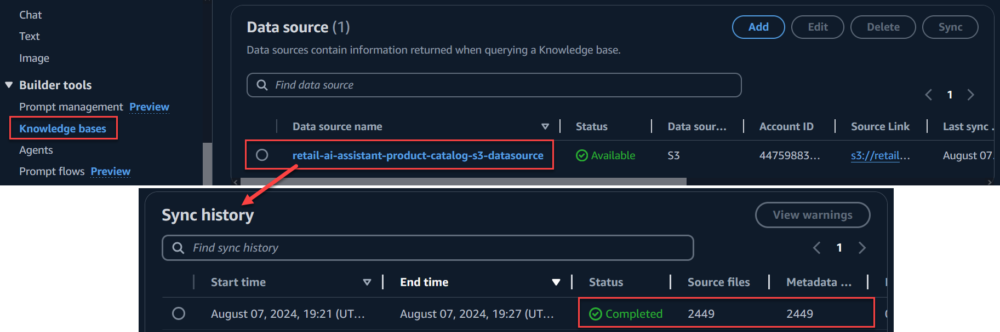

# Guidance Title (required)

The Guidance title should be consistent with the title established first in Alchemy.

**Example:** *Guidance for Product Substitutions on AWS*

This title correlates exactly to the Guidance it’s linked to, including its corresponding sample code repository. 


## Table of Contents (required)

List the top-level sections of the README template, along with a hyperlink to the specific section.

### Required

1. [Overview](#overview-required)
    - [Cost](#cost)
2. [Prerequisites](#prerequisites-required)
    - [Operating System](#operating-system-required)
3. [Deployment Steps](#deployment-steps-required)
4. [Deployment Validation](#deployment-validation-required)
5. [Running the Guidance](#running-the-guidance-required)
6. [Next Steps](#next-steps-required)
7. [Cleanup](#cleanup-required)

***Optional***

8. [FAQ, known issues, additional considerations, and limitations](#faq-known-issues-additional-considerations-and-limitations-optional)
9. [Revisions](#revisions-optional)
10. [Notices](#notices-optional)
11. [Authors](#authors-optional)

## Overview
This Guidance demonstrates how to create powerful, generative AI-driven shopping assistant that enhances customer experience and drives sales through context-aware, AI-powered interactions. The solution utilizes [Agents for Amazon Bedrock](https://docs.aws.amazon.com/bedrock/latest/userguide/agents.html) to orchestrate various functions like personalized and related product recommendations, dynamic contextual product comparisons, seamless cart management, and automated order & email confirmation. The agent seamlessly integrates with existing company systems and data securely and minimizes the time and complexity needed for building sophisticated LLM (Large Language Model) Agents. 

## Solution Overview
This Guidance deploys a Streamlit-based Python web application on Amazon ECS Fargate, which calls the [Amazon Bedrock API](https://docs.aws.amazon.com/bedrock/latest/userguide/what-is-bedrock.html) for natural language conversations.The Shopping Agent is built using Agents for Amazon Bedrock which utilizes Anthropic's Claude Sonnet 3 model to interpret user queries and orchestrate multi-step tasks for efficient and seamless shopping experience. 

To assist customers in finding relevant products, the Shopping Agent is integrated with a [Knowledges Bases for Amazon Bedrock](https://docs.aws.amazon.com/bedrock/latest/userguide/knowledge-bases.html), which embeds product catalog details from Amazon S3 and stores them in [Amazon OpenSearch Serverless](https://docs.aws.amazon.com/opensearch-service/latest/developerguide/serverless.html) for vector search. Additionally, the Shopping Agent includes an Action Group that utilizes AWS Lambda function with OpenAPI Schema to manage API operations such as order creation, inventory checks, and sending email confirmations. 

The Solution also implements various techniques for minimizing LLM Hallucinations:
- Clear & structured step-by-step instructions to LLM for performing specific tasks
- Instructions to avoid suggesting alternate brand names or products not found in catalog
- Asking LLM to self-validate the API inputs & JSON structure using a technique called self-consistency prompt
- Provide templates for formatting the product list in LLM response and email structure using agent's Orchestration prompt template
- Guided UI interactions through forms and buttons to avoid free-form user input mistakes

### Architecture

This section will have architecture diagram and steps from Solution Guidance.

### Cost

You are responsible for the cost of the AWS services used while running this Guidance. As of August 2024, the cost for running this Guidance with the default settings in the US East (N. Virginia) Region is approximately $250 per month for processing 100,000 requests.

We recommend creating a [Budget](https://docs.aws.amazon.com/cost-management/latest/userguide/budgets-managing-costs.html) through [AWS Cost Explorer](https://aws.amazon.com/aws-cost-management/aws-cost-explorer/) to help manage costs. Prices are subject to change. For full details, refer to the pricing webpage for each AWS service used in this Guidance.

### Sample Cost Table
The following table provides a sample cost breakdown for deploying this Guidance with the default parameters in the US East (N. Virginia) Region for one month.

| AWS Service                  | Dimensions                                                                 | Cost [USD] |
|------------------------------|----------------------------------------------------------------------------|------------|
| Amazon ECS Fargate           | 1 task running 24/7                                                        | $50.00     |
| Application Load Balancer    | 1 ALB with HTTPS listener                                                  | $22.00     |
| Amazon Cognito               | 1,000 active users per month                                               | $0.00      |
| Amazon CloudFront            | 500 MB images served, 1 TB data transfer                                   | $85.00     |
| Amazon S3                    | 100 GB storage                                                             | $2.50      |
| Amazon API Gateway           | 1,000,000 REST API calls per month                                         | $3.50      |
| AWS Lambda                   | 1 million requests, 400,000 GB-seconds                                     | $16.00     |
| Amazon OpenSearch Serverless | 60 MB index size, 2,449 documents, base pricing                            | $21.00     |
| Amazon CloudWatch Logs       | 10 GB ingested data                                                        | $1.00      |
| Amazon Bedrock               | Estimated usage for Anthropic Claude Sonnet 3 and Amazon Titan embeddings  | $50.00*    |

*Note: The cost for Amazon Bedrock's Anthropic Claude Sonnet 3 model and Amazon Titan embeddings is estimated based on assumed usage of 10,000 user queries and 5,000 embedding operations per month. There might be base pricing for these services irrespective of usage.

**Note : Once you have created a sample cost table using AWS Pricing Calculator, copy the cost breakdown to below table and upload a PDF of the cost estimation on BuilderSpace. Do not add the link to the pricing calculator in the ReadMe.**

The following table provides a sample cost breakdown for deploying this Guidance with the default parameters in the US East (N. Virginia) Region for one month.

| AWS service  | Dimensions | Cost [USD] |
| ----------- | ------------ | ------------ |
| Amazon API Gateway | 1,000,000 REST API calls per month  | $ 3.50month |
| Amazon Cognito | 1,000 active users per month without advanced security feature | $ 0.00 |

## Prerequisites 

### Operating System 

- These deployment instructions are compatible with **Mac, Windows, and Linux** operating systems. The commands provided are primarily for a Unix-like shell (bash), which is available on Mac and Linux by default. Windows users can use the Windows Subsystem for Linux (WSL) or Git Bash to run these commands.
- Ensure the following packages and modules are installed:
  - [Python 3.12](https://www.python.org/downloads/)
  - [AWS CLI version 2.15.30 or higher](https://docs.aws.amazon.com/cli/latest/userguide/getting-started-install.html)
  - [AWS CDK version 2.150.0 or higher](https://docs.aws.amazon.com/cdk/v2/guide/cli.html)
  - [Docker](https://docs.docker.com/get-docker/) (running locally)


### AWS account requirements

- This deployment requires you to have access granted to Amazon Bedrock for Anthropic's Claude Sonnet 3 and Amazon's Titan embedding models in your AWS region.
- Check Models support by AWS Region [here](https://docs.aws.amazon.com/bedrock/latest/userguide/models-regions.html).

**AWS resources required:**
- Amazon Elastic Container Service (ECS)
- Amazon Cognito and Amazon Route 53 DNS record (reuired if you want Cognito Hoseted UI authentication)
- Amazon CloudFront
- Amazon Simple Storage Service (S3)
- Amazon API Gateway
- AWS Lambda
- Amazon OpenSearch Serverless
- Agents and Knowledge Base for Amazon Bedrock
-  IAM user or role with permissions to create resources in the target AWS account and region to be used for CDK deployment.

### Amazon Bedrock Model Access
   - Request access for Anthropic's Claude Sonnet 3 and Amazon'a Titan embedding models from the AWS Management Console.
   - Follow the steps in the [AWS Bedrock documentation](https://docs.aws.amazon.com/bedrock/latest/userguide/model-access.html) to request model access.

### aws cdk bootstrap

This Guidance uses aws-cdk. If you are using AWS CDK for the first time, please perform the following bootstrapping:
  ```bash
  cdk bootstrap aws://<ACCOUNT-ID>/<REGION>
  ```
   - Replace `ACCOUNT-ID` and `REGION` with your AWS Account ID and AWS REGION.
   - For more details, refer to the [AWS CDK Workshop](https://catalog.us-east-1.prod.workshops.aws/workshops/10141411-0192-4021-afa8-2436f3c66bd8/en-US/3000-python-workshop/200-create-project/250-deploy).

### Service limits
 - This Guidance is designed to work within the default service limits of AWS.
 - However, if you encounter any service limit issues during deployment, you can check your service limits and request increases by following the [AWS Service Quotas](https://docs.aws.amazon.com/servicequotas/latest/userguide/intro.html) documentation. 

### Supported Regions
   - This Guidance is best suited for deployment in US East (N. Virginia) `us-east-1` and US West (Oregon) `us-west-2`.
   - It must be deployed in regions where Amazon OpenSearch Serverless, Agents for Amazon Bedrock and access to Anthropic's Claude Sonnet 3 and Amazon's Titan embeddings models are available.
   - Check AWS regional service availability [here](https://aws.amazon.com/about-aws/global-infrastructure/regional-product-services/).


## Deployment Steps

1. **Clone the Repository**
   - Clone the repository and naviagte to deployment fodler using the following commands:
     ```bash
     git clone https://github.com/aws-solutions-library-samples/guidance-for-generative-ai-shopping-assistant-using-agents-for-amazon-bedrock.git

     cd guidance-for-generative-ai-shopping-assistant-using-agents-for-amazon-bedrock/deployment
     ```

2. **Set Up Python Virtual Environment**
   - Create and activate a Python virtual environment:
     ```bash
     python3 -m venv .venv # Or use `python -m venv .venv`
     source .venv/bin/activate  # On Windows, use `.venv\Scripts\activate`
     ```

3. **Install Dependencies**
   - Install the required packages:
     ```bash
     pip install -r requirements.txt
     ```

4. **Configure AWS Credentials**
   - Ensure your AWS credentials are configured:
     ```bash
     aws configure
     ```
5. **Enable Cognito Hosted UI Authentication (Optional but Recommended)**
- To enable Authentication and HTTPS encryption for the app:
   - Copy the `.env.example` file to `.env`:
     ```bash
     cp .env.example .env
     ```
   - Open the `.env` file and set the following variables:
     ```
     HOSTED_ZONE_NAME = "your-route53-hosted-zone-domain-name"
     HOSTED_ZONE_ID = "your-route53-hosted-zone-id"
     ```
   Replace `your-route53-hosted-zone-domain-name` and `yyour-route53-hosted-zone-id` with your actual Amazon Route 53 Hosted Zone name and ID.

6. **Deploy All Stacks**
   - Deploy all stacks defined in the `app.py`:
     ```bash
     cdk deploy --all
     ```

7. **CDK Deploy Stack Summary**
    - The cdk will deploy the following Parent Stacks:
      - **S3CloudFrontStack**: Sets up Amazon CloudFront distribution and Amazon S3 bucket for image hosting.
      - **AppStack**: Deploys the Retail AI assistant Streamlit app on ECS Fargate and enables Cognito Hosted UI authentication if Route53 Hosted Zone details are provided.
      - **ProductServiceStack**: Creates the product service API using AWS Lamda and API Gateway.
      - **ShoppingAgentStack**: Implements the Retail shopping agent functionality using Agents for Amazon Bedrock and Knowledgse Base with Amazon OpenSearch Serverless vector store.
    - Dependencies are set to ensure proper resource creation order.

## Deployment Validation
- Verify the deployment by checking the [AWS CloudFormation console](https://console.aws.amazon.com/cloudformation) for the status of all stacks.
- Ensure all resources are created successfully in the specified cdk AWS region.
- Verify Product catalog Knowledge Base was setup successfully:
   - Capture the Cloudformation output value for `ProductCatalog-KnowledgeBaseName` in `ShoppingAgentStack`stack.
   - Navigate to the above product catalog knowledge base details page through [Knowledge Bases in Amazon Bedrock console](https://console.aws.amazon.com/bedrock). 
   - Scroll down to the `Data Source` section, open the S3 data source and verify the **Status** and **Source Files** count in *Sync History* as below:

   


## Running the Guidance 
1. **Capture the AppUrl**
   - After deploying the `RetailAIAssistantAppStack`, capture the `AppUrl` output from the AWS CloudFormation console. This URL is essential for accessing the deployed application.

2. **Access the Application**
   - Open a web browser and navigate to the captured `AppUrl`.
   - If Route 53 Hosted domain details were provided during deployment, you will be redirected to the Cognito Hosted UI Authentication page.

3. **Authenticate Using Cognito**
   - Log in using the default user credentials:
     - **Username**: `demo-user`
     - **Password**: `TempPass123@`
   - Note: This password is temporary and will need to be changed upon first login.

4. **Start interacting with Shopping Agent Page**
   - Once logged in, use the left navigation panel to go to the "Shopping Agent" page.
   - Start interacting with the AI assistant by entering queries such as:
     - "I am going on a camping trip with my friends and looking for good quality tents."
     - After receiving a list of products, you can ask for a "Show me side by side comparison of the tents."

5. **Interact with Product Options**
   - Click on "View Details," "Add to Cart," or "Buy Now" for the products.
   - When adding to the cart, specify the quantity of items.
   - On selecting "Buy Now," fill out the shipping form with address information and click "Submit."
   - The agent will confirm the order details. Once confirmed, it will place the order and send an email confirmation.

6. **Set Session Context for Seamless Conversation (Optional)**
   - Navigate to the "Agent Session State" tab on the screen.
   - Select a User Profile from the dropdown to set the session context.
   - With the session context set, you can type commands like "I want to buy one of [sunglass name]," and the agent will use session attributes to complete the order without asking for shipping details again.

### Expected Output
- Once the application is running, you should see the AI assistant interface open in your browser, allowing you to interact with the application and perform various shopping-related tasks.


## Test the App Locally on your machine

To run the application locally, follow these steps:

1. **Navigate to the Application Source Directory**
   - Change your directory to the `source/retail_ai_assistant_app` folder where the application source code is located:
     ```bash
     cd source/retail_ai_assistant_app
     ```

2. **Install Python Requirements**
   - Install the required packages listed in the `requirements.txt` file:
     ```bash
     pip install -r requirements.txt
     ```

3. **Copy and Configure the `.env` File**
   - Copy the [source/.env.example](source/.env.example) file to create a new `.env` file inside `source/retail_ai_assistant_app` folder:

     ```bash
     cp .env.example .env
     ```

4. **Retrieve Values from AWS Systems Manager Parameter Store**
   - Navigate to the `AWS Systems Manager Parameter Store` in the AWS Management Console.
   - Search for the following parameter store keys and fill out the corresponding values in your `.env` file.
   - Note: `{app_name}` will be name of your app specified in [deployment/lib/config.py](deployment/lib/config.py).

     - **USER_POOL_ID**: `/${app_name}/cognito/user-pool-id`
     - **USER_POOL_CLIENT_ID**: `/${app_name}/cognito/client-id`
     - **USER_POOL_CLIENT_SECRET**: `/${app_name}/cognito/client-secret`
     - **USER_POOL_DOMAIN**: `/${app_name}/cognito/user-pool-domain`
     - **API_URL**: `/${app_name}/apigateway/url`
     - **SHOPPING_AGENT_ID**: `/${app_name}/bedrock/shopping-agent-id`
     - **SHOPPING_AGENT_ALIAS_ID**: `/${app_name}/bedrock/shopping-agent-alias-id` (No Alias ID will invoke Draft Agent version)

5. **Set AWS Region and Account ID**
   - In the `.env` file, also set the following values:
     - **AWS_REGION**: Your AWS account region
     - **AWS_ACCOUNT_ID**: Your AWS account ID

6. **Run the Application Locally**
   - With the `.env` file configured, you can now start the application using Streamlit:
     ```bash
     streamlit run Home.py
     ```
   - This command will launch the application in your default web browser.

7. **Expected Output**
- Once the application is running, you should see the Streamlit interface open in your browser, allowing you to interact with the AI assistant.


## Next Steps

Here are some next steps to consider for improving robustness and accuracy of the agent.
- Modify the Agent for your use case and data and api.

- Implement robust validation mechanisms before presenting the actual response to the customer such as - Validate the product list in LLM response against catalog before presenting it to end customer.

- Start by implenting more guided user experience on frontend to avoid any user input mistakes and avoid any harmful or toxic content

- Move the Bedrock Agent API call to AWS Lambda - API Gateway for added security and separation from frontend streamlit app

- Continuosly monitor model performance and accuracy using [Model Evaluation for Amazon Bedrock](https://docs.aws.amazon.com/bedrock/latest/userguide/model-evaluation.html).

- [Advanced Prompts](https://docs.aws.amazon.com/bedrock/latest/userguide/advanced-prompts.html) for Agents can further enhance agent's accuracy by modifying default prompt templates for different processing steps. 

- [Guardrails for Amazon Bedrock](https://docs.aws.amazon.com/bedrock/latest/userguide/guardrails.html) enables you to implement safeguards for your generative AI applications based on your use cases and responsible AI policies


## Cleanup (required)

- Include detailed instructions, commands, and console actions to delete the deployed Guidance.
- If the Guidance requires manual deletion of resources, such as the content of an S3 bucket, please specify.


## FAQ, known issues, additional considerations, and limitations (optional)


**Known issues (optional)**

<If there are common known issues, or errors that can occur during the Guidance deployment, describe the issue and resolution steps here>


**Additional considerations (if applicable)**

<Include considerations the customer must know while using the Guidance, such as anti-patterns, or billing considerations.>

**Examples:**

- “This Guidance creates a public AWS bucket required for the use-case.”
- “This Guidance created an Amazon SageMaker notebook that is billed per hour irrespective of usage.”
- “This Guidance creates unauthenticated public API endpoints.”


Provide a link to the *GitHub issues page* for users to provide feedback.


**Example:** *“For any feedback, questions, or suggestions, please use the issues tab under this repo.”*

## Revisions (optional)

Document all notable changes to this project.

Consider formatting this section based on Keep a Changelog, and adhering to Semantic Versioning.

## Notices (optional)

Include a legal disclaimer

**Example:**
*Customers are responsible for making their own independent assessment of the information in this Guidance. This Guidance: (a) is for informational purposes only, (b) represents AWS current product offerings and practices, which are subject to change without notice, and (c) does not create any commitments or assurances from AWS and its affiliates, suppliers or licensors. AWS products or services are provided “as is” without warranties, representations, or conditions of any kind, whether express or implied. AWS responsibilities and liabilities to its customers are controlled by AWS agreements, and this Guidance is not part of, nor does it modify, any agreement between AWS and its customers.*


## Authors (optional)

Begum Firdousi Abbas (firdousi-begum)
